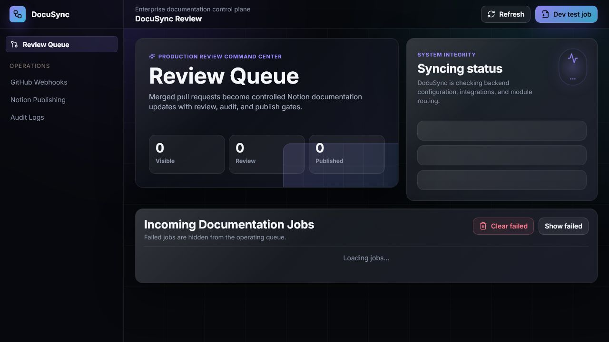
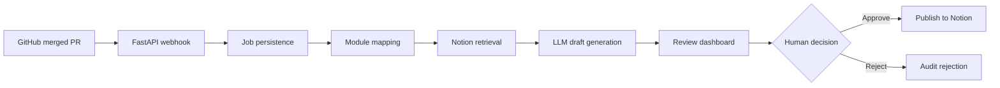

# DocuSync

DocuSync is a production-oriented documentation automation platform for engineering teams. It listens to merged GitHub pull requests, identifies the impacted documentation area, retrieves the current Notion content, generates an LLM-assisted Markdown update, and routes the result through a human review workflow before publishing.



## What It Does

- Receives GitHub pull request merge events through a signed webhook.
- Extracts PR metadata, changed files, and unified diffs.
- Maps code paths to the correct documentation ownership area.
- Retrieves current documentation from Notion.
- Uses Gemini or another configured LLM provider to draft a targeted documentation update.
- Presents the draft in a premium reviewer dashboard with patch, diff, audit trail, approval, and rejection controls.
- Publishes approved documentation back to Notion.
- Stores jobs, review decisions, audit events, and failures in PostgreSQL.

## Product Architecture



## Tech Stack

- **Frontend:** Next.js, React, TypeScript, Lucide icons
- **Backend:** FastAPI, SQLAlchemy, PostgreSQL
- **Database:** Supabase PostgreSQL
- **LLM:** Gemini by default, provider abstraction ready for other models
- **Integrations:** GitHub Webhooks, Notion REST API
- **Deployment:** Vercel multi-service deployment

## Repository Structure

```text
docusync/
  backend/              FastAPI service, integrations, processing pipeline
  frontend/             Next.js review dashboard
  config/               Module-to-documentation mapping
  docs/                 Product documentation, assets, deployment notes
  vercel.json           Vercel multi-service routing
```

## Local Development

### Backend

```powershell
cd backend
python -m venv .venv
.\.venv\Scripts\Activate.ps1
pip install -r requirements.txt
Copy-Item .env.example .env
uvicorn app.main:app --reload --port 8000
```

### Frontend

```powershell
cd frontend
npm install
Copy-Item .env.local.example .env.local
npm run dev
```

Open `http://localhost:3000`.

## Required Environment Variables

Backend:

```text
DATABASE_URL=
DIRECT_URL=
GITHUB_WEBHOOK_SECRET=
GITHUB_TOKEN=
LLM_PROVIDER=gemini
GEMINI_API_KEY=
NOTION_API_KEY=
NOTION_DATABASE_OR_PAGE_ID=
MODULE_MAPPING_PATH=config/module_mapping.json
CORS_ORIGINS=
```

Frontend:

```text
NEXT_PUBLIC_API_BASE_URL=/_backend
```

Never commit real credentials. Keep local secrets in `.env` files and configure production secrets in Vercel.

## GitHub Webhook

Configure the repository webhook to send pull request events to:

```text
https://your-domain.vercel.app/_backend/webhooks/github
```

Use the same secret in GitHub and `GITHUB_WEBHOOK_SECRET`. DocuSync only processes pull request events where the action is `closed` and `merged` is `true`.

## Documentation Mapping

`config/module_mapping.json` maps code paths to Notion documentation targets. Example ownership areas:

- `backend/` -> Backend API Docs
- `frontend/` -> Frontend Dashboard Docs
- `config/` and `docs/` -> Project Documentation

The backend also includes a bundled fallback mapping file for serverless deployments.

## Deployment

DocuSync is configured for Vercel as a multi-service project:

- `/` routes to the Next.js dashboard.
- `/_backend` routes to the FastAPI API.

Database tables are initialized by the backend startup path and can also be initialized manually:

```powershell
cd backend
.\.venv\Scripts\python.exe scripts\init_db.py
```

## Testing

Backend:

```powershell
cd backend
.\.venv\Scripts\python.exe -m pytest
```

Frontend:

```powershell
cd frontend
npm run build
```

## Current Product Status

DocuSync includes the full core workflow:

- signed GitHub webhook intake,
- Supabase-backed job persistence,
- Notion retrieval and publishing,
- Gemini-powered draft generation,
- module-aware routing,
- premium dark-mode review dashboard,
- expandable queue drawers with editable patches,
- human approve/reject controls,
- audit trail visibility.

## Roadmap

- Reviewer authentication and role-based permissions.
- Background worker queue for large PRs and long Notion operations.
- Semantic diff scoring and reviewer edit-distance metrics.
- Organization-level documentation ownership rules.
- Deployment observability, retry queues, and operational alerts.
